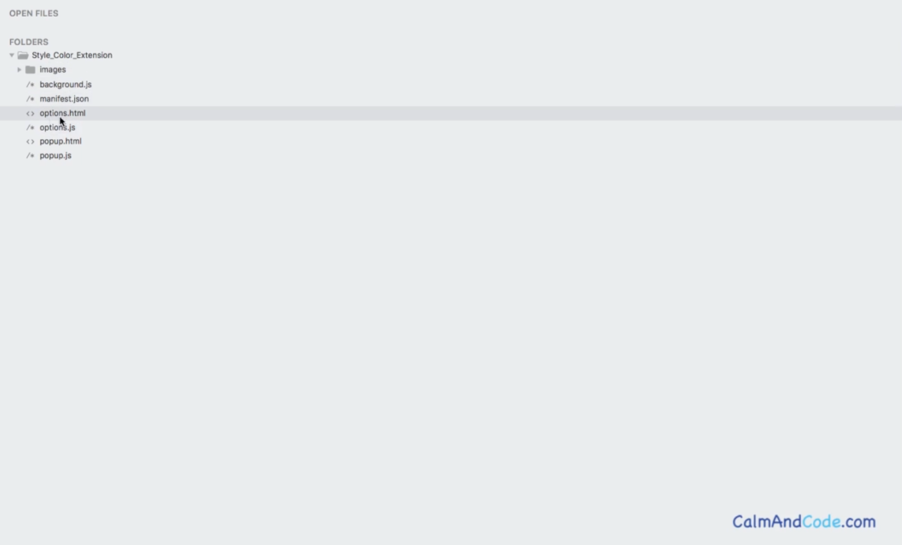

# DEV-03, Extension Structure

## Tags: [basics]

## Link: [<https://www.udemy.com/course/google-chrome-extensions/learn/lecture/17780308#overview>]

## What are they made of?

    They are made of Components

    Components contain:
        background scripts
        content scripts
        an options page
        UI elements
        various logic files

    Not all of these are mandatory. Some are, but some are optional.

## Typical Extension

## Manifest.json

    This is mandatory
    This file is used to store information about the extension such as:
        the name
        the description
        the permissions
        the location of assets

## Background.js

    This contains code that runs in the background such as listening for a
    specific change in Google Chrome browsers tab or window.

## popup.html

    This is part of the user interface which enables the user to interact with the extension and then use it.

## popup.js

    This provides functionality for the popup.html to listen to those interactions the user makes.

## options.html

    This is optional. You can add options that the user can set for their experience
