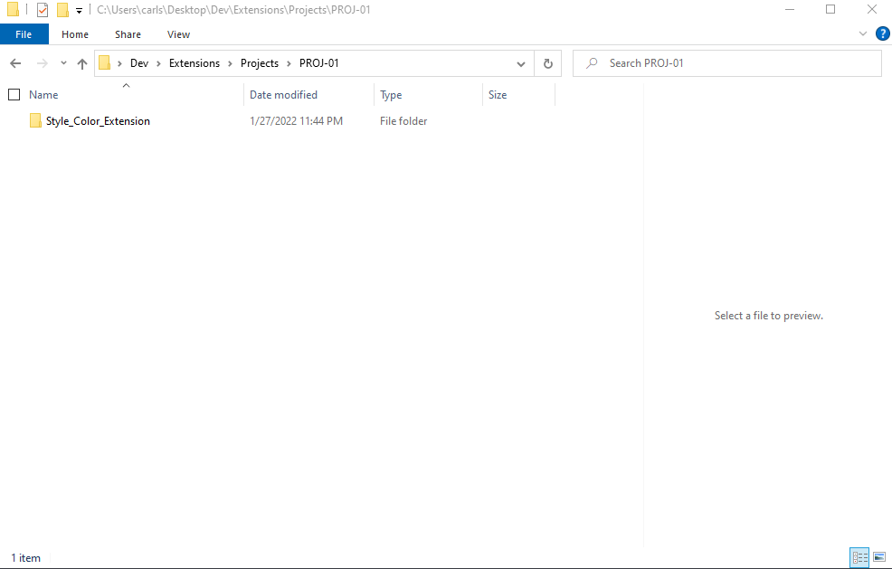

# DEV-04, Create Extension Folder

## Tags: [basics]

## Link: [<https://www.udemy.com/course/google-chrome-extensions/learn/lecture/17780336#overview>]

## Folder Naming
    Whatever you want. But it is best for them to represent the intent of the extension.

