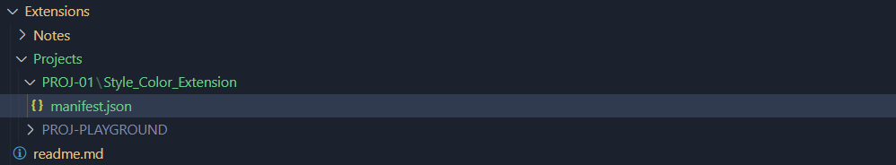
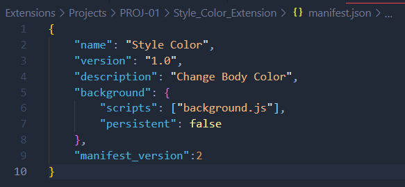

# DEV-05, Manifest

## Tags: [basics]

## Link: [<https://www.udemy.com/course/google-chrome-extensions/learn/lecture/17780342#overview>]

## Naming

    It must be named manifest.json exactly

## Example

## Example of Contents

