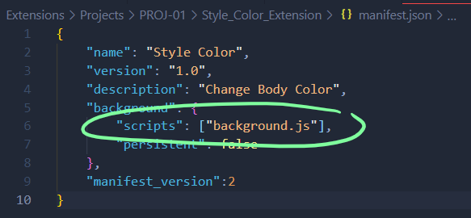
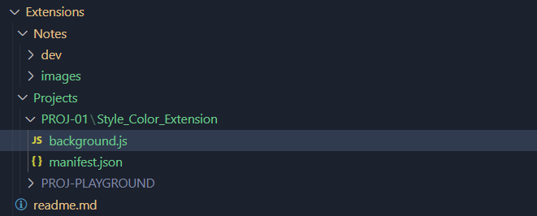

# DEV-06, Background Script

## Tags: [basics]

## Link: [<https://www.udemy.com/course/google-chrome-extensions/learn/lecture/17780352#overview>]

## What are they?

    The background script is the extension's even handler.
    it contains listeners for browser events that are important to the extension

## Registering

    Background scripts must be registered in the manifest
    Registering a background script in the manifest thells the extension which file to reference

## Where to go from here?

## What does a reference to a content script look like?

## Background Scripts vs Content Scripts

    A content script is a part of your extension that runs in context of a particular web page.
    A Background script are in context to the extension.

    Background scripts can access all of the WebExtension Javascript APIs, 
    but they can't directly access the content of web pages.

    So if your extension needs to do that, you need content scripts.
    But content scripts can only access a small subset of the WebExtension APIs.

    BUT
    Content scripts can communicate with background scripts using a messaging system,
    and thereby indeirectly access the WebExtension APIs.

    

