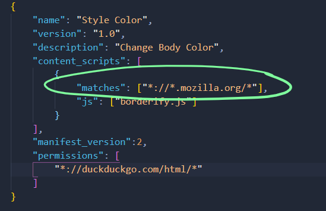

# DEV-07, Mozilla Based Extensions

## Tags: [basics, mozilla]

## Link: [<https://www.youtube.com/watch?v=9NY3wx9iEzY>, <https://developer.mozilla.org/en-US/docs/Mozilla/Add-ons/WebExtensions/manifest.json/content_scripts>, <https://developer.mozilla.org/en-US/docs/Mozilla/Add-ons/WebExtensions/manifest.json/permissions>]

## Content Scripts

    Content scripts are provided only by mozilla extensions, not chrome.

## Matches

    This is a required key within content scripts.
    It specifies the URL patterns to be matched in order for the scripts to be loaded.

## Permissions

    Used to request special powers for your extension.
    The browser will inform the user at install time that the extension is requesting certain privileges, and ask them to confirm that they are happy to grant these privileges.

## What kind of permissions can I get

    The key can contain three kinds of permissions:

    host permissions
    API permissions
    the activeTab permission
