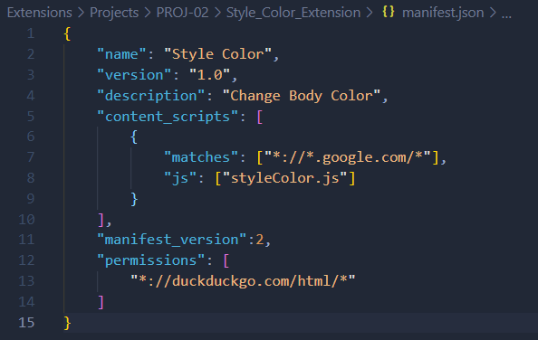
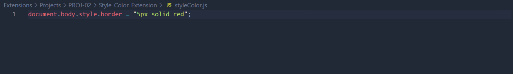
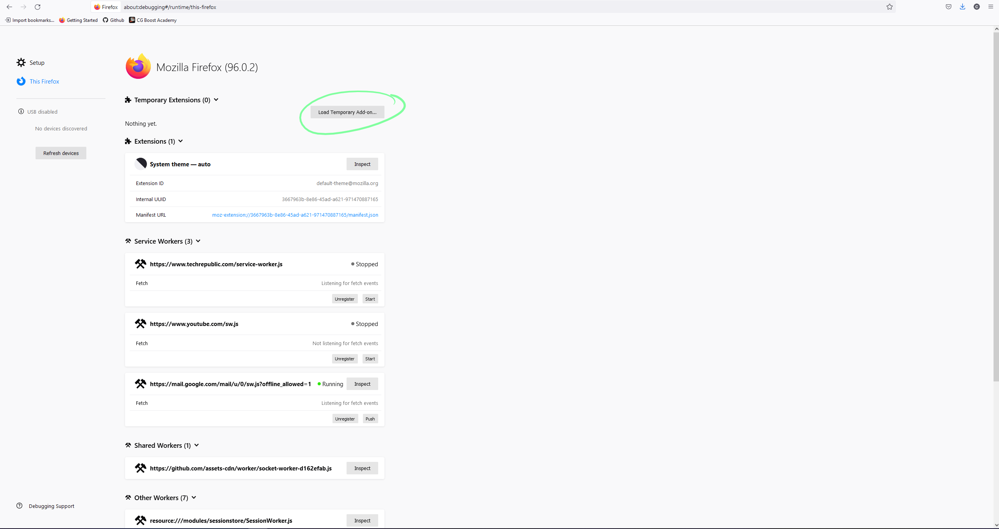
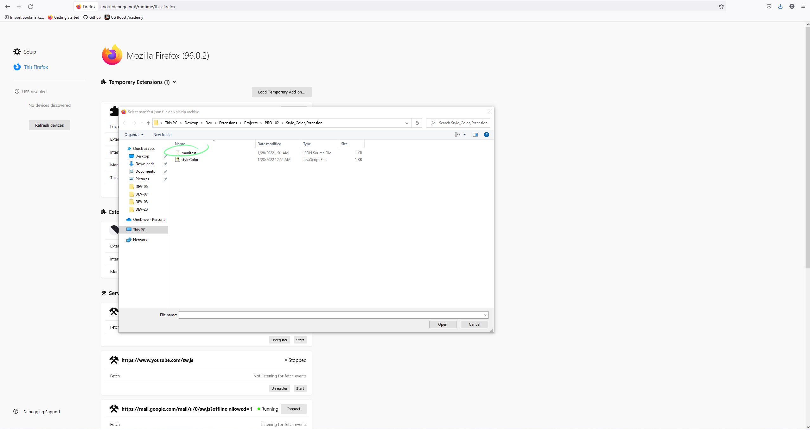
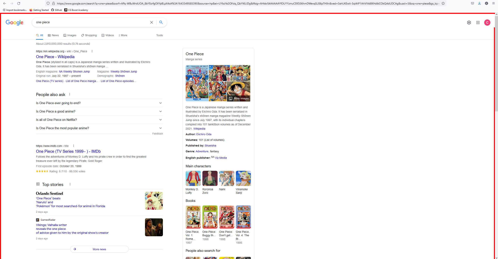

# DEV-08, Debugging an Extension

## Tags: [basics, mozilla]

## Link: [<https://www.youtube.com/watch?v=9NY3wx9iEzY>,<https://developer.mozilla.org/en-US/docs/Tools/about:debugging#opening_the_aboutdebugging_page>]

## Update the Manifest.json

## Add code to our Content Script

## Navigate to this link on FireFox

<about:debugging#/runtime/this-firefox>

    And select "Load Temporary Add-on"

## Navigate to the Manifest.json

## Check the matches website

